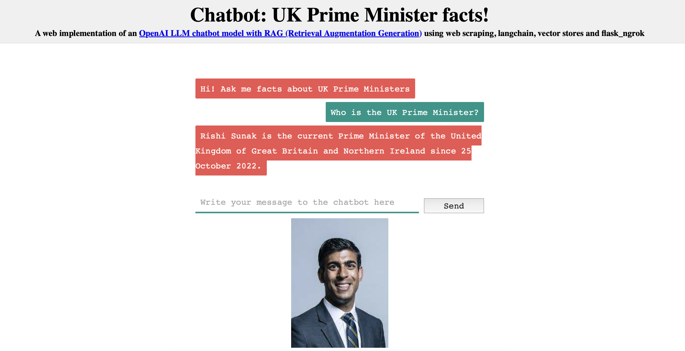

# LLM Chatbot with RAG
### Objective

Build a chatbot app using an LLM model with RAG (Retrieval Augmentation Generation)

### Description of app

A web implementation of an OpenAI LLM chatbot model (text-davinci-003) with RAG (Retrieval Augmentation Generation) using web scraping, langchain, vector stores and Flask via ngrok.

Chatbot set up to answer questions on facts related to UK Prime Ministers by scraping https://en.wikipedia.org/wiki/Prime_Minister_of_the_United_Kingdom and utilising OpenAI embeddings to create a vector store (Chroma). 

Flask routes render an HTML interface for user input and bot responses. The chatbot responds based on the given user input, considering the context retrieved from the vector store. To exit the chat, the user can type 'exit'.

### Usage

1. Install required packages: langchain, openai, chromadb, tiktoken, pyngrok, flask_ngrok.
2. Set up OpenAI API key and ngrok authentication tokens.
3. Execute the script to start the Flask application.
4. Access the chatbot interface via a browser.

### Model

text-davinci-003 is an example of an InstructGPT ie a finetuned version of GPT-3 released November 2022 by OpenAI.

### Results

- Vector store necessary to enable fast bot responses
- No hyperparameter tuning was performed on this small project since the bot was able to answer questions related to facts on the wiki page satisfactorily
- LLM response to "Who is the current Prime Minister of the United Kingdom?" without RAG was Boris Johnson (ie out-of-date response since text-davinci-003 released November 2022). After RAG, it correctly returned Rishi Sunak (see screenshot below)

Screenshot of chatbot app:
 
 

 

### Next steps

- Clean up data retrieved from https://en.wikipedia.org/wiki/Prime_Minister_of_the_United_Kingdom. Eg bot claimed incorrectly that Penny Mordaunt had been Prime Minister - thought to be incorrectly deduced from a link in the references section. 
- Try using a base model that has been fine tuned for chat rather than text completion
- Experiment with newer base models
- Hyperparameter tuning
- Expand training data
- Fine tune the LLM: self-supervised learning, supervised learning and/or reinforcement learning (https://towardsdatascience.com/fine-tuning-large-language-models-llms-23473d763b91)
- Implement a context management system to dynamically adjust repsonses based on ongoing conversation
- Experiment with different prompt structures

### References 

- https://www.coursera.org/learn/generative-ai-with-llms 
- https://towardsdatascience.com/all-you-need-to-know-to-build-your-first-llm-app-eb982c78ffac
- https://platform.openai.com/docs/introduction
- https://ngrok.com/docs/
- https://python.langchain.com/docs/get_started/introduction
- https://github.com/s2y2/seq2seq_chatbot/